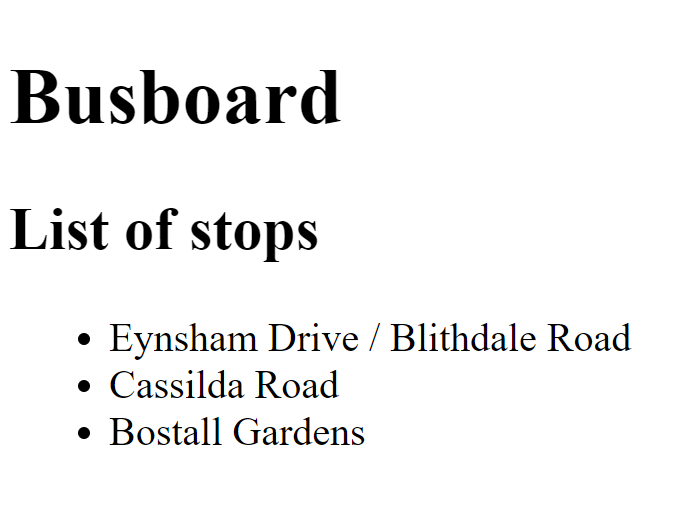
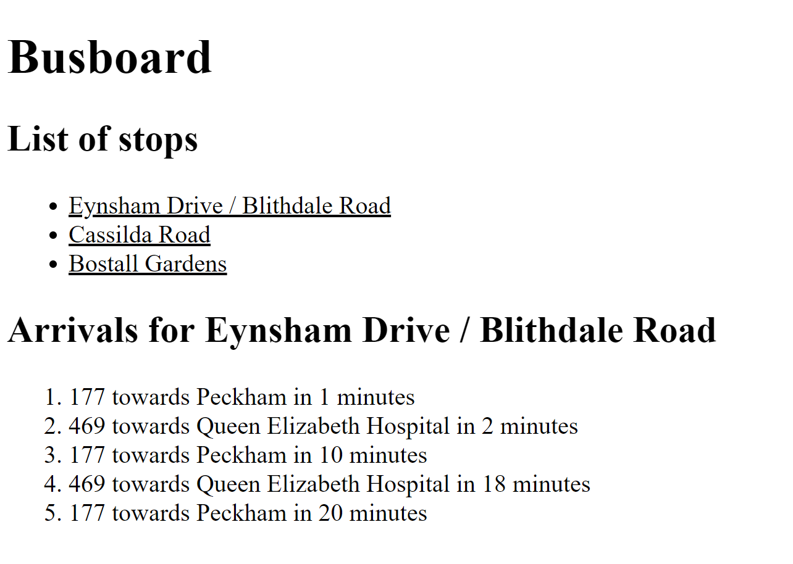

# Busboard Part 2 - Multiple stops

## Aims

In this part, we'll aim to display not just the details of a single stop, but a list of stops. We'll allow the user to select a stop, and then the details of that stop will be shown.

## Another component

Let's create a new component that we'll use for showing the list of stops. Generate it in the same way that you generated your component in the previous part.

This component should simply display a list of stops - something like this:



The stops won't be real yet, so just make some up!

## User selections

Next, we'll need a way for your users to select a stop by clicking on it. You can react to click events by using the `(click)` attribute in your template like so:

```html
<div (click)="onClick()">Click me!</div>
```

This will call the `onClick` method on your component class, which you'll need to define yourself. Maybe use a more descriptive name, though! You can also pass arguments to the method you reference in the `(click)` attribute - any binding that is available to your template through curly braces is also available as an argument.

Write a method on your component class that will save the user's selection when they click on a stop.

## Displaying the arrivals

You already have a component that you can use for displaying arrivals, so there's no need to write a new one. This is the beauty of Angular components - you can re-use the same component in lots of different contexts.

You will need to make a change to it, though. Currently the stop is hardcoded into the component, but we want it to display the stop the user has selected. You can do this using an `Input` binding. Make sure to import `Input` from `@angular/core` in the component class file, and then define a member variable like this:

```typescript
@Input() stop: Stop
```

This allows you to pass in a value for this member variable using an HTML attribute. The syntax is as follows:

```html
<my-stop-details-component [stop]="selectedStop"></my-stop-details-component>
```

Update your stops component so that when a selection is made, it displays the details for that stop beneath the list:



You should consider using the `ngIf` directive. This completely removes the element it is attached to from the DOM if a particular condition is not met:

```html
<div *ngIf="condition">This won't display if `condition` is false</div>
```

## Wrapping up

As always, commit your code and push it to GitHub. A model solution is available from [here](https://github.com/scl-softwire/angular-training/tree/part2/busboard).