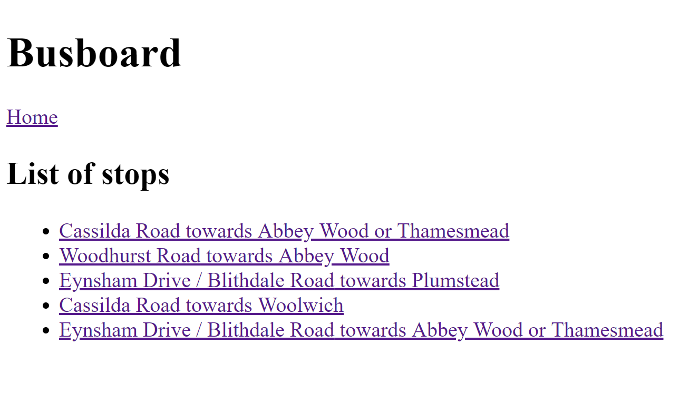
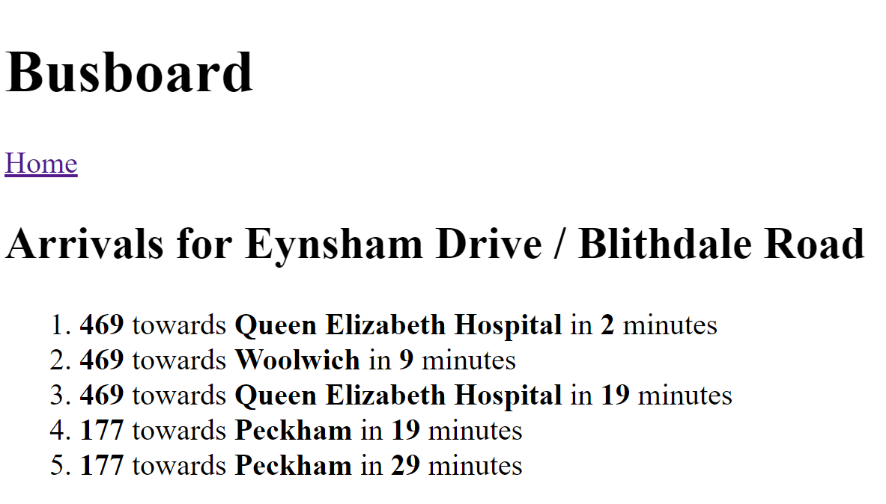

# Busboard Part 6 - Arrivals API

## Aims

In this part, we will reinstate the arrivals functionality by getting real arrivals data from the TfL API. No more fake data!

You will then be able to click on a stop, and see data about its arrivals, like this:

## Arrivals API

[Here's the documentation](https://api.tfl.gov.uk/swagger/ui/index.html?url=/swagger/docs/v1#!/StopPoint/StopPoint_Arrivals) for the API endpoint you'll need to use. The only parameter it takes is the Naptan ID of the stop you want arrivals for, which would have been available to you in the result of your previous API call. If you didn't use that part of the result, go back and modify your previous API call so that you save the Naptan ID's of each of the stops.

## Using the API

Just like in the previous part, you should now write some code that uses this API to get a list of arrivals for a given stop. Refer back to the guidance there if you get stuck, and of course, feel free to ask your trainer for help!

You can now make your stop details component work again! The stop ID is already available to it, so you just need to make the API call and subscribe to the resulting `Observable`, just as you will have done on the stops page!

After you're done, the entire app should be working as it did after Part 4, but with all real data.

## Wrapping up

We're almost there! Remember to commit your code and push it to GitHub. This part's model solution is located [here](https://github.com/scl-softwire/angular-training/tree/part6/busboard).